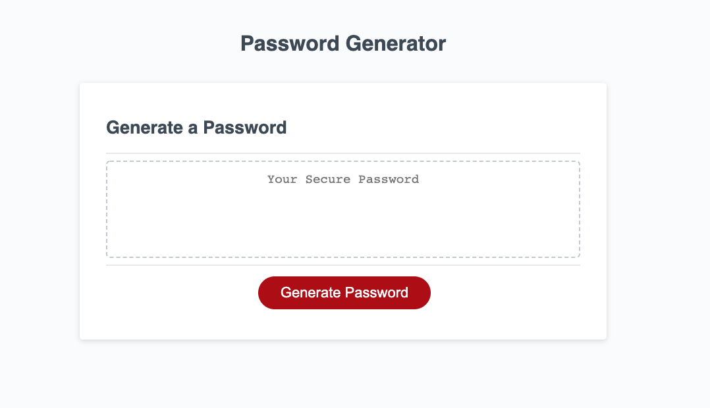

# Secure Password Generator

## Description

This project features a password generator that a user can use to generate a random password based on specific criteria that they choose. The user is prompted to select the length of their password (between 8 and 128 characters) as well as if they would like to include uppercase letters, lowercase letters, numbers and/or symbols. When all selection criteria is met, a password is generated and appears on the screen.

Final Website Link: https://shelbyandersen.github.io/password-generator/

## Overview

Generate Password - to generate a password the user should begin by clicking the "Generate Password" button. When this button is clicked, this begins the code to start generating the password. There are a few requirements that need to be met for a password to be displayed.

Password Length - The password length is the first prompt that displays to the user. The user must choose a length between 8 and 128 characters. If they choose a number less than 8, greater than 128, or type a symbol or letter, then an alert will show up for the user asking them to try again. When the user chooses an appropriate number, then are asked 4 remaining questions to complete the password generation process.

Uppercase Letters - the user is asked if they would like to include uppercase letters in their password. \*

Lowercase Letters - the user is asked if they would like to include lowercase letters in their password. \*

Numbers - the user is asked if they would like to include numbers in their password. \*

Symbols - the user is asked if they would like to include symbols in their password.\*

\*\* The user must choose at least 1 option when asked if they would like to include letters, numbers, or symbols.

Password Appears on Screen - When the user is done answering the password questions, their password will display on the screen. If the user clicks "Generate Password" again, the cycle will begin again.

## Installation

The code for the Responsive Portfolio can be found on github using the following link: https://github.com/shelbyandersen/password-generator

## Usage

The Password Generator Application has an index.html file, a style.css file, and a script.js file.

Code will need to be taken from the repo on github and changes can be made:

https://github.com/shelbyandersen/password-generator

## Credits

The initial design of this application was provided by Trilogy Educational Services.

The application was completed by Shelby Andersen

## License

At this time there is no license associated with this project.

---

© 2020 Shelby Andersen in Collaboration with Georgia Tech Coding Boot Camp. All Rights Reserved.
